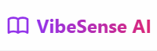
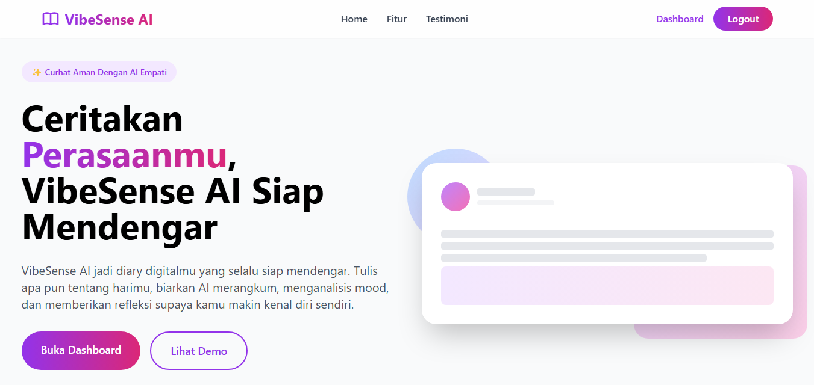

<div align="center">
  
</div>

<h3 align="center">VibeSenseAi: Smart Mood Tracker & Diary</h3>

<div align="center">

[]()
[]()
[]() 
[]()
[]()
[]()
[](LICENSE.md)

</div>

---

<p align="center"> Sebuah Website kesehatan mental cerdas yang tidak hanya menyimpan cerita Anda, tetapi juga memahami perasaan Anda menggunakan Kecerdasan Artificial.
    <br> 
</p>

## 📝 Table of Contents

- [Demo & Preview](#demo)
- [Problem Statement](#problem_statement)
- [Idea / Solution](#idea)
- [Dependencies / Limitations](#limitations)
- [Future Scope](#future_scope)
- [Setting up a local environment](#getting_started)
- [Usage](#usage)
- [Technology Stack](#tech_stack)
- [Authors](#authors)
- [Acknowledgments](#acknowledgments)

## 🎥 Demo & Preview <a name = "demo"></a>

Jangan lewatkan kesempatan untuk melihat VibeSenseAi beraksi. Klik tautan di bawah ini untuk mencoba aplikasi atau menonton demonstrasi kami:

<div align="center">

### 🚀 [COBA APLIKASI SEKARANG (LIVE DEMO)](https://link-aplikasi-anda.com) 🚀

### 📺 [TONTON VIDEO DEMONSTRASI](https://link-video-anda.com) 📺

</div>

<br>


> *Tampilan Halaman utama dari aplikasi vibesenseAi*

---

## 🧐 Problem Statement <a name = "problem_statement"></a>

Mengikuti format analisis bisnis untuk memahami urgensi proyek ini:

- **IDEAL:** Setiap orang seharusnya memiliki kesadaran tinggi terhadap kesehatan mental mereka. Menulis jurnal (*diary*) sebaiknya bukan hanya aktivitas pasif, tetapi menjadi alat refleksi yang memberikan wawasan (*insight*) tentang pola emosi dan suasana hati seseorang dari waktu ke waktu.

- **REALITY:** Kebanyakan aplikasi diary konvensional hanya bersifat statis (hanya menyimpan teks). Pengguna sering kali menulis curhatan panjang namun kesulitan melihat "benang merah" dari kondisi emosional mereka sendiri. Data teks menumpuk tanpa memberikan makna lebih lanjut.

- **CONSEQUENCES:** Tanpa umpan balik atau visualisasi emosi, pengguna sering kehilangan motivasi untuk rutin menulis diary (inkonsistensi). Lebih buruk lagi, tanda-tanda awal stres, kecemasan, atau depresi yang tersirat dalam tulisan mereka sering kali terlewatkan dan tidak tertangani dengan baik.

## 💡 Idea / Solution <a name = "idea"></a>

**VibeSenseAi** hadir sebagai solusi yang menjembatani *journaling* tradisional dengan teknologi **Kecerdasan Artificial (KA)**.

Solusi kami sederhana namun berdampak:
1.  Pengguna menulis catatan harian seperti biasa.
2.  Sistem kami, yang terintegrasi dengan **Kolosal.ai**, secara otomatis memproses teks tersebut.
3.  Aplikasi mendeteksi sentimen (Mood Analysis) dan menyimpannya secara terstruktur di database.
4.  Pengguna mendapatkan visualisasi mood mereka secara instan, mengubah teks cerita menjadi data kesehatan mental yang berharga.

## ⛓️ Dependencies / Limitations <a name = "limitations"></a>

- **Koneksi Internet:** Karena aplikasi membutuhkan akses ke API eksternal (Kolosal.ai) untuk memproses teks, aplikasi ini tidak dapat berfungsi penuh secara offline.
- **Limitasi API:** Ketergantungan pada *Rate Limit* dan kuota dari penyedia layanan KA (Kolosal).
- **Nuansa Bahasa (Slang):** Meskipun model KA sudah canggih, penggunaan bahasa daerah yang sangat spesifik atau *slang* baru mungkin mengurangi akurasi deteksi mood.
- **Privasi API:** Data teks dikirim ke pihak ketiga (Kolosal) untuk diproses, meskipun kami memastikan transmisi aman, ini adalah pertimbangan arsitektur yang perlu diketahui.

## 🚀 Future Scope <a name = "future_scope"></a>

Berikut adalah fitur yang belum sempat kami kembangkan selama Hackathon namun menjadi peta jalan (roadmap) masa depan VibeSenseAi:

- **Sistem Rekomendasi Cerdas:** Memberikan saran aktivitas (misal: "Anda tampak sedih, coba dengarkan playlist ini" atau "Coba latihan pernapasan ini") berdasarkan hasil analisis mood di tabel `diary_analysis`.
- **Grafik Tren Bulanan:** Visualisasi data mood dalam bentuk grafik garis untuk melihat fluktuasi emosi dalam rentang waktu bulanan/tahunan.
- **Voice-to-Text Diary:** Fitur untuk merekam suara curhatan yang otomatis dikonversi menjadi teks diary.

## 🏁 Getting Started <a name = "getting_started"></a>

Instruksi ini akan membantu Anda menjalankan salinan proyek di mesin lokal Anda untuk tujuan pengembangan dan pengujian.

### Prerequisites

Pastikan perangkat lunak berikut sudah terinstal di komputer Anda:

- Xampp/laragon/Herd
- PHP >= 8.3
- Composer (_wajib jika pakai xampp_)
- Node.js & NPM
- MySQL

### Installing

Ikuti langkah-langkah berikut untuk menyiapkan lingkungan pengembangan (Development Env):

1. **Clone Repositori**
```
git clone https://github.com/LabibAbdullah1/VibesenseAi.git

cd VibesenseAi
```

2. **Instal Dependensi Backend (Laravel)**

```
composer install

```

3. **Instal Dependensi Frontend (Tailwind/Vite)**
```
npm install 
npm run build
```
4. **Konfigurasi Environment Duplikat file .env.example menjadi .env. Pilih perintah sesuai sistem operasi Anda :**

   - Untuk macOS / Linux / Git Bash:
   ```
   cp .env.example .env
   ```
   - Untuk Windows (Command Prompt/PowerShell):
   ```
   copy .env.example .env
   ```

**Penting: Buka file .env yang baru saja dibuat, lalu sesuaikan konfigurasi berikut :**
```
KOLOSAL_API_KEY=isi dengan apikey kolosal kamu
KOLOSAL_BASE_URL=https://api.kolosal.ai/v1/chat/completions
KOLOSAL_MODEL='Claude Sonnet 4.5' 
```
5. **Generate Key & Migrasi Database Jalankan perintah ini untuk membuat key aplikasi dan tabel database :**
```
php artisan key:generate
php artisan migrate
```
6. **Jalankan Aplikasi :**
```
php artisan serve
```
## 🎈 Usage <a name="usage"></a>
 1. Register/Login: Buat akun baru atau masuk menggunakan kredensial yang ada.

2. Create Diary: Klik tombol "Tulis diary", masukkan isi cerita Anda hari ini.

3. Analyze: Simpan diary. Sistem akan otomatis memproses data ke KA.

4. View Dashboard: Lihat diary Anda yang kini sudah memiliki label mood di dashboard utama.

## ⛏️ Built With <a name = "tech_stack"></a>
- Laravel 12 - Backend Framework

- Tailwind CSS - Frontend Styling

- Blade - Template Engine

- Kolosal.ai - Proses Analysis menggunakan API

- MySQL - Database Management

- Laravel Breeze - Authentication

## ✍️ Authors <a name = "authors"></a>
- [@LabibAbdullah1](https://github.com/LabibAbdullah1)  - Backend & Logic

- [@rfldisyah](https://github.com/rfldisyah) - Frontend & UI/UX

  ### Lihat juga daftar kontributor yang berpartisipasi dalam proyek ini.

  - [@LeniComelll-coder](https://github.com/LeniComelll-coder)

  - [@alfa03r](https://github.com/alfa03r)

## 🎉 Acknowledgments <a name = "acknowledgments"></a>
- Terima kasih kepada Kolosal.ai atas penyediaan API yang hebat.

- Inspirasi dari tren aplikasi kesehatan mental modern.

- Dokumentasi Laravel yang luar biasa.


